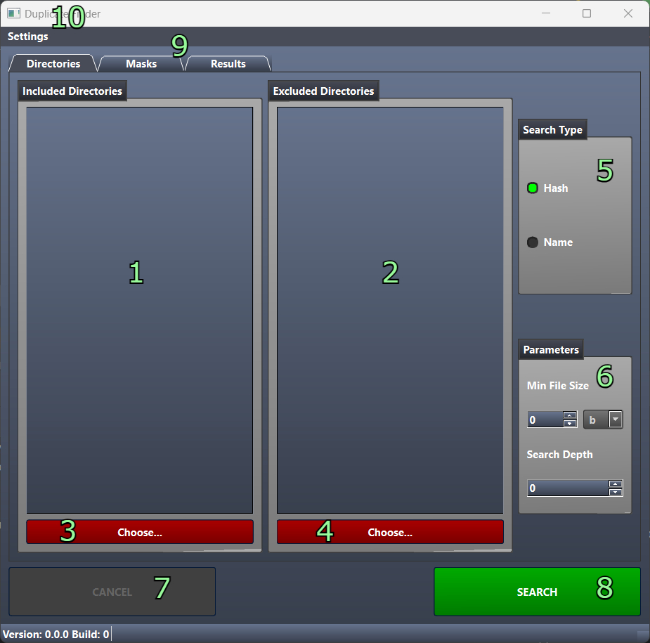
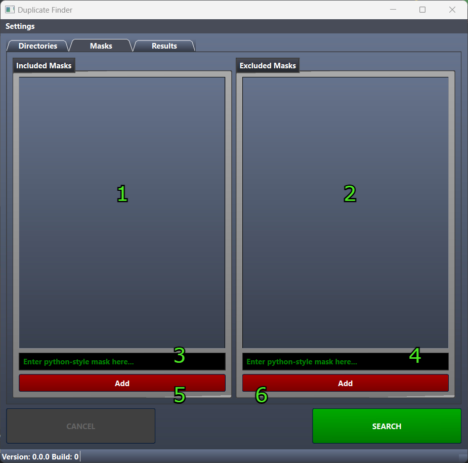
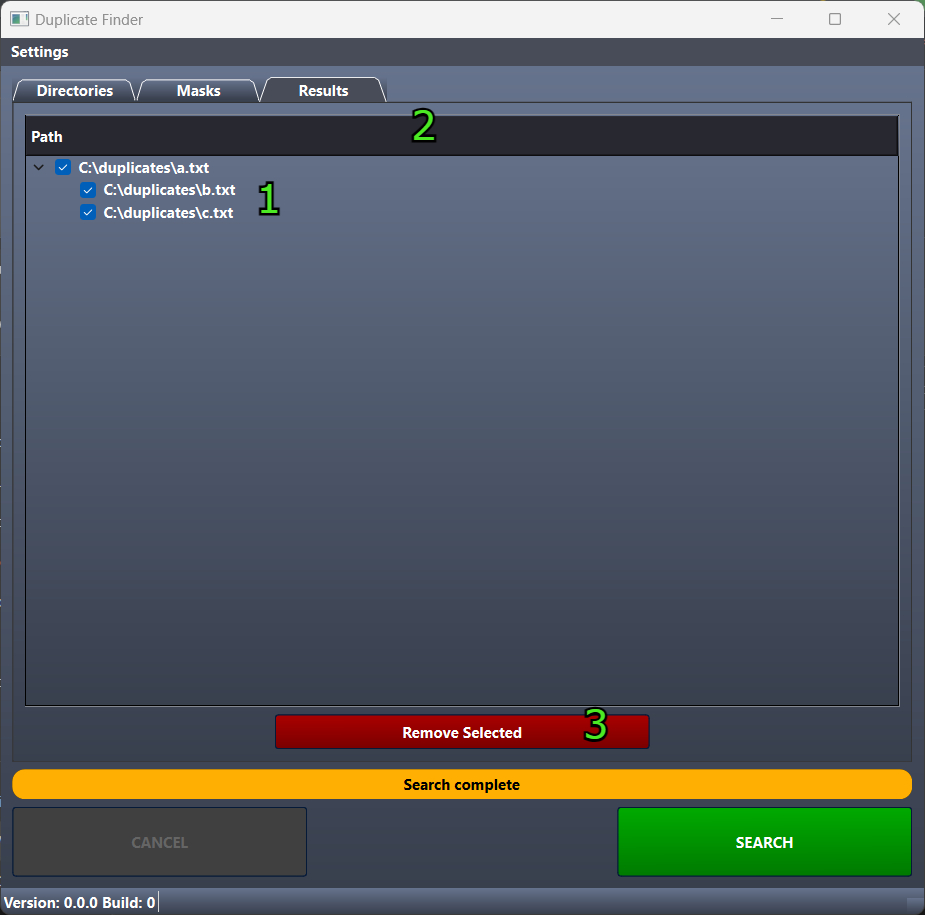
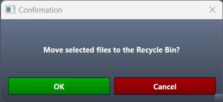

# Duplicate Finder

## Description

**Duplicate Finder** is a Python-based desktop application designed to help users identify and manage duplicate files on
their systems efficiently. It provides a user-friendly GUI built with QT, aiming to simplify and enhance the experience
of dealing with redundant files. Whether it's finding duplicates by hash or by name, Duplicate Finder is your one-stop
solution for managing your disk space better.

## Features

- **Find duplicates by hash or by name:** Use unique file hashes or file names to identify duplicate files, catering to
  your specific search preferences.
- **Flexible search masks:** Include or exclude certain files during your search with our easy-to-use search mask
  feature.
- **Search within subdirectories:** Extend your search beyond the current directory to any of its subdirectories for a
  thorough duplicate check.
- **Move duplicates to trash:** Found a duplicate? Send it straight to the trash with just one click, streamlining your
  file management process.

## Installation Instructions

The application is distributed as a single executable file and is compatible with Windows and Ubuntu(Linux). To install,
simply download the executable file from the latest release and run it on your system.

## Usage Instructions

### Main window



When you open the app, you will see the main windows, as on image above.

1. List of directories to include for search. To start search, you must choose at least 1 directory
2. List of directories to exclude from search. Optional. Excluding has more priority than including, so if you include
   directories `A/` and `B/` and then exclude `B/` than app will include only `A/`
3. Button to choose directories to include
4. Button to choose directories to exclude
5. Choosing Search type. Hash is default. If you choose Hash than app will compare file content. If you choose name the
   app will compare file names, so files with equal names will be counted as duplicates regardless of the content.
6. Additional search parameters.
    - Min file size - it's minimum size to include file to search. 0 - include all files
    - Search depth - depth of search for subdirectories. 0 - don't include subdirectories
7. Cancel button. Used to cancel search or removing.
8. Search button - click to start duplicates search
9. Additional tabs

- Directories - main tab to choose directories and search parameters
- Masks - tab to set up masks (see next image)
- Results - search results (see after next image)

10. Setting. Here you can choose different theme (light or dark, dark is default) and different languages. Available
    languages are: Chinese, English, French, German, Italian, Japanese, Russian, Spanish. These settings are persistent,
    they will be saved for future app runs.

### Masks window



This window is to set up masks. Mask is a pattern, that will trigger on some string (in this case, on file names).

This app use [Python-style masks](https://docs.python.org/3/howto/regex.html)

1. List of masks to include file. App will include only files with the name that matches at least one mask. If no masks
   defined - all files will be included
2. List of masks to exclude file. App will exclude files with the name that matches the mask(s).
3. Input to write new include mask.
4. Input to write new exclude mask
5. Add mask from include input line to list of included masks
6. Add mask from exclude input line to list of excluded masks

### Results window



This window is to see search results (if any) and to remove duplicates.

1. List of duplicates. For duplicates original file is the file with minimum lexicographic (alphabet sort) name.
2. Duplicates header. If you doubleclick it, it will select/deselect all files
3. Remove button. It's used to remove all selected duplicates. Original files will not be removed. All removed files
   will be moved in Recycle Bin. Before removing, you need to confirm it in separate dialog window (as in next image).



## Command-line options

- `--cli`: Run the application from the console.

- `-v` or `--version`: Print the application version and exit.

- `--loglevel`: Set the logging level. Accepts one of the following options: "debug", "info", "warning", "error", "
  critical". Default is "info".

When `--cli` is specified, the following options are available:

- `--include-directories`: An array of directories to include. This option is required when --cli is specified.

- `--exclude-directories`: An array of directories to exclude. Default is an empty array.

- `--include-masks`: An array of masks to include. Default is an empty array.

- `--exclude-masks`: An array of masks to exclude. Default is an empty array.

- `--min-file-size-bytes`: Minimum file size in bytes. Default is 0.

- `--depth`: Depth of directory scanning. Default is 0.

- `--search-type`: Type of search to perform. Default is 'hash'.

- `--remove-after-find`: Removes the file after it is found. Default is False.

### Example

```bash
./duplicate_finder --cli --include-directories /path/to/directory 
--exclude-directories /path/to/exclude --min-file-size-bytes 500 
--depth 2 --search-type hash
```

This command will run the application in CLI mode, scan the directory at /path/to/directory and its subdirectories up to
2 levels deep, excluding /path/to/exclude. It will search for duplicate files based on their hash and only consider
files that are at least 500 bytes in size.

## Contributing

Contributions are welcome. Feel free to open an issue or submit a pull request.

## Contact

For any queries or suggestions, please open an issue on this repository.

## License

Duplicate Finder is licensed under the [MIT](https://opensource.org/licenses/MIT) license. See `LICENSE` for more
information.

## Third-Party Libraries

This project uses the following third-party libraries:

### PySide6, PySide6_Addons, PySide6_Essentials

- Version: 6.5.1
- License: [LGPLv3](https://www.gnu.org/licenses/lgpl-3.0.html)
- Copyright: [The Qt Company](https://www.qt.io/)

### pytest

- Version: 7.3.1
- License: [MIT](https://opensource.org/licenses/MIT)
- Copyright: [Holger Krekel and pytest-dev contributors](https://pypi.org/project/pytest/)

### Send2Trash

- Version: 1.8.2
- License: [BSD](https://opensource.org/licenses/BSD-2-Clause)
- Copyright: [Andrew Senetar]https://pypi.org/project/Send2Trash/

### xxhash

- Version: 3.2.0
- License: [BSD 2-Clause](https://opensource.org/licenses/BSD-2-Clause)
- Copyright: [Yue Du](https://pypi.org/project/xxhash/)

### Adaptic Theme

- License: [MIT](https://opensource.org/licenses/MIT)
- Copyright: [DevSec Studio](https://qss-stock.devsecstudio.com/)

### Martin Fitzpatrick's Code

- License: [BSD](https://opensource.org/licenses/BSD-2-Clause) & [MIT](https://opensource.org/licenses/MIT)
- Copyright: [Martin Fitzpatrick](https://www.pythonguis.com/authors/martin-fitzpatrick/)